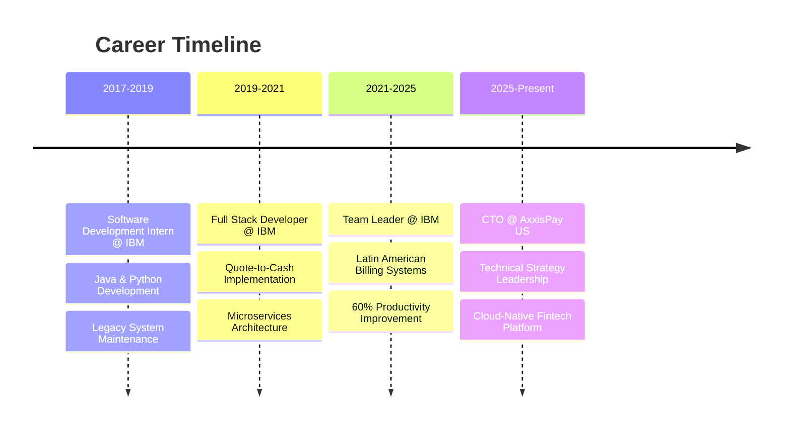

# Hey there! I'm Henrique 👋

<div align="center">
  


</div>

## 🚀 About Me

```typescript
const henrique = {
  title: "Senior Software Engineer & CTO",
  company: "AxxisPay US",
  location: "Remote ğŸŒ",
  experience: "8+ years",
  passion: ["Fintech", "Clean Architecture", "Performance Optimization"],
  currentlyLearning: ["AI/ML Integration", "Blockchain", "DeFi"],
  hobbies: ["ğŸï¸ Cars", "🵠Music Production", "💪 Working Out"],
  motto: "Code with purpose, architect with vision"
};
```

## ğŸ› ï¸ Tech Arsenal

<div align="center">

### Languages & Frameworks


### Cloud & DevOps


### Databases


</div>

## 📊 GitHub Stats

<div align="center">
  
<!--  -->


<!--  -->

</div>

## 🢠Professional Journey


```mermaid
timeline
    title Career Timeline
    2017-2019 : Software Development Intern @ IBM
              : Java & Python Development
              : Legacy System Maintenance
    2019-2021 : Full Stack Developer @ IBM
              : Quote-to-Cash Implementation
              : Microservices Architecture
    2021-2025 : Team Leader @ IBM
              : Latin American Billing Systems
              : 60% Productivity Improvement
    2025-Present : CTO @ AxxisPay US
                 : Technical Strategy Leadership
                 : Cloud-Native Fintech Platform
```

## 🯠What I'm Up To

- 🔭 **Currently building:** Cloud-native fintech solutions at AxxisPay US
- 🌱 **Learning:** AI/ML integration, Blockchain technologies, DeFi protocols
- 👯 **Looking to collaborate on:** Open source fintech projects, performance optimization tools
- 💬 **Ask me about:** System architecture, fintech solutions, legacy modernization
- âš¡ **Fun fact:** I can debug code while producing beats and planning my next car mod! ğŸµğŸï¸

## ğŸï¸ Beyond Code

<div align="center">

### When I'm Not Coding...

| ğŸï¸ **Cars** | 🵠**Music Production** | 💪 **Fitness** |
|:---:|:---:|:---:|
| Tuning & Modding | Electronic Music | Strength Training |
| Track Days | Beat Making | Cardio Sessions |
| Car Photography | Sound Design | Nutrition Planning |

</div>

## 🤠Let's Connect!

<div align="center">

[](https://linkedin.com/in/hgthome)
[](https://hgtho.me)
[](mailto:henrique.thome@outlook.com)


</div>
